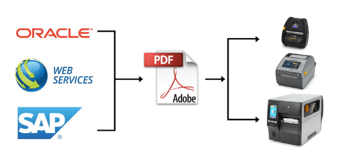
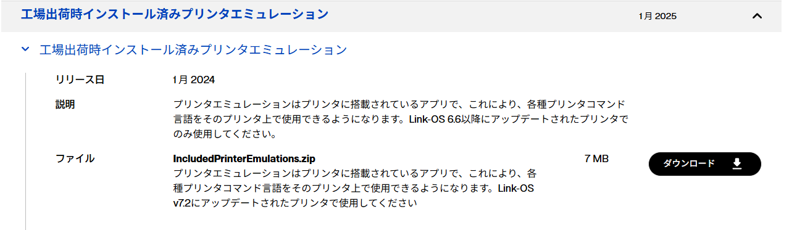

</br>

#### Zebra Printer PDF Direct Demo Guide and Materials
# PDF Direct サンプルと設定ガイド  
 
以下は **Zebra プリンタで「PDF Direct（ドライバレスでPDFデータを直接印刷）」を利用するための手順・概要ガイド**です。Zebra の PDF Direct とは、Zebra プリンタ上で PDF ファイルを直接受信・印刷できる機能で、従来必要だったドライバやミドルウェアを不要にします。



---

</br>

## 1. PDF Direct とは（概要）

**PDF Direct** は、Zebra の **Print DNA 対応プリンタ**が PDF ファイルを直接受信して印刷できるようにする **Printer Emulation（プリンタ内実装機能）**です。

* ERP（例：SAP／Oracle）や基幹系から PDF をそのまま送信し、プリンタ側で PDF を解釈・印刷できます。
* ドライバや変換ミドルウェア不要で印刷できるため、システム構成を簡素化できます。

**メリット**

* PDF が所定サイズで作成されていれば、プリンタ側でスケーリング不要
* ミドルウェア・変換ロジック不要
* PDF という汎用的なテクノロジーを用いてシステム開発・構築が可能

**デメリット**

* ZPLよりもスループットが低下する可能性がある
* ZPLと比較して印字品質が低下する可能性がある

</br>

---
## 2. 対象プリンタ・対応条件

</br>

### ■ 対象

* **Link-OS / Print DNA 対応 Zebra プリンタ**
  （例：ZD、ZT、ZQ、シリーズなど一部機種）
* **Link-OS 6.3 以降**が使用可能なモデル

</br>

### ■ 要件

1. **ファームウェアが PDF Direct をサポートしていること**
   → Link-OS 6.3 以降では PDF Direct が無償でご利用できます。([Zebra Developer][2])

<!--
1. **ネットワーク経由（TCP/IP 9100 など）で PDF を送信できること**
2. 印刷サイズ（ページサイズ）は **プリンタのラベル幅に合致**させること
-->

</br>

---
## 3. PDF Direct の有効化（プリンタ設定）

</br>

### A. PDF Direct（Printer Emulation) のインストール

* プリンタのサポートページから「工場出荷時インストール済みプリンタエミュレーション」をダウンロードし、Zebra の **ZDownloader ツール** などでプリンタにインストールします。
    
    </br>

    [PDFダイレクトアクティベーション](https://support-new.zebra.com/ja/article/000014538)


    </br>

    


</br>

### B. PDF Direct を有効化

1. プリンタに対して以下コマンドを送信します：

    ```
    ! U1 setvar "apl.enable" "pdf"
    ```
    → PDF Direct モードが有効になります。

    </br>


    **確認コマンド**

    ```
    ! U1 getvar "apl.enable"
    ```
    </br>


    * 設定変更後は必ずプリンタを再起動してください。

    * メニューから有効化できる機種では、プリンタ表示／Menu → Program Languageから「PDF」を選ぶことでも可能です。（モデル依存）

</br>

---
## 4. PDF Direct の利用方法

</br>

### A. 9100 Raw で送信

PDF ファイルを TCP 9100 経由でプリンタに Raw 送信します（例：telnet / Socket / 自作ソケットコード）。

印刷サイズは **PDF のページサイズをプリンタのラベル幅に一致させておくことが基本**です。（一番高品質でパフォーマンスよく印刷ができます）

</br>

### B. 開発／SDK 経由で送信

Zebra の Link-OS SDK や Browser Print などから **sendFile() / sendFileContents()** 相当の API を利用して PDF を送信できます。

PDF Direct 対応プリンタにおいて、これらの API がそのまま PDF を処理し印刷します。

</br>

### C. SFTP／Cloud Connect経由で送信

ZebraのAPIなどを用いて、クラウドやオンプレサーバからPDFを送信して印刷ができます。

</br>

### D. その他 I/F経由で送信

USBなど他のI/F経由でもPDFを送信して印刷ができます。ただし、PDFのサイズが大きい場合は転送速度の遅いI/Fを利用すると、転送時間がかかり、印刷スループットが低下する可能性があります。

</br>

---

## 5. 運用上のポイント

</br>

### ■ ラベルサイズと PDF サイズの一致が理想

* PDF ファイルのページサイズ＝ラベル紙の実寸で作成しておくこと
  → スケーリングによるバーコード読み取り不良を防ぎます。
* PDF ファイルのスケーリングが必要な場合は下記「10. PDF Directの便利コマンド」を参照ください。


### ■ プリンタ解像度と PDFデータの解像度の一致が理想

* PDFデータの解像度＝プリンタ解像度で作成しておくこと
  → スケーリングによるバーコード読み取り不良を防ぎます。
* PDF ファイルのスケーリングが必要な場合は下記「10. PDF Directの便利コマンド」を参照ください。

</br>

### ■ ドライバの必要性

* 通常業務プリンタドライバ（Zebra Designer など）は不要です。
* ただし、Windows 共有プリンタとして構成して利用する場合はドライバの設定が必要なケースもあります。

</br>

### ■ 既存ワークフローとの共存

* ZPL など従来言語と PDF Direct を併用する場合、**メニューや SGD で言語モード切替**が必要なプリンタもあります（モデル依存）

</br>


---
### 10. PDF Directの便利コマンド

状況によってはスケーリングが必要なことがあります。その際は下記コマンドの活用をご検討ください。

* コマンドの詳細については「ZPL II, ZBI 2, Set-Get-Do, Mirror, WML Programming Guide」を参照ください。

    </br>

    [参考資料：apl.settings](https://docs.zebra.com/us/en/printers/software/zpl-pg/c-sgd-printer-commands/r-sgd-apl-settings.html)

    </br>

    1. PDFデータをプリンタに設定された用紙サイズに自動調整
        ```
        ! U1 setvar "apl.settings" "scale-to-fit" 
        ```
    2. 任意の縮尺をする。
        ```
        ! U1 setvar "apl.settings" "scale=50x50"
        ```
    3. 印刷の向きを変更する。
        ```
        ! U1 setvar "apl.settings" "orient=N“
        ```

</br>

## 98. 参考リンク

* [PDF Direct 公式サイト](https://www.zebra.com/us/en/software/printer-software/pdf-direct-printer-emulation.html) 

* [Youtube: Zebra DevTalk | Printing PDFs with Zebra Link-OS Printers](https://www.youtube.com/watch?v=Tw-yv7EJX1E)


    </br>

---


## 99. 高品質な文字を印刷するコツ（補足資料）

PDFの埋め込みフォント  
https://supportcommunity.zebra.com/s/article/000022734?language=en_US   
https://supportcommunity.zebra.com/s/article/000022734?language=ja  
